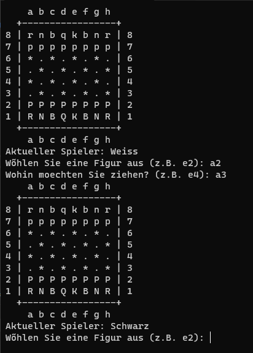
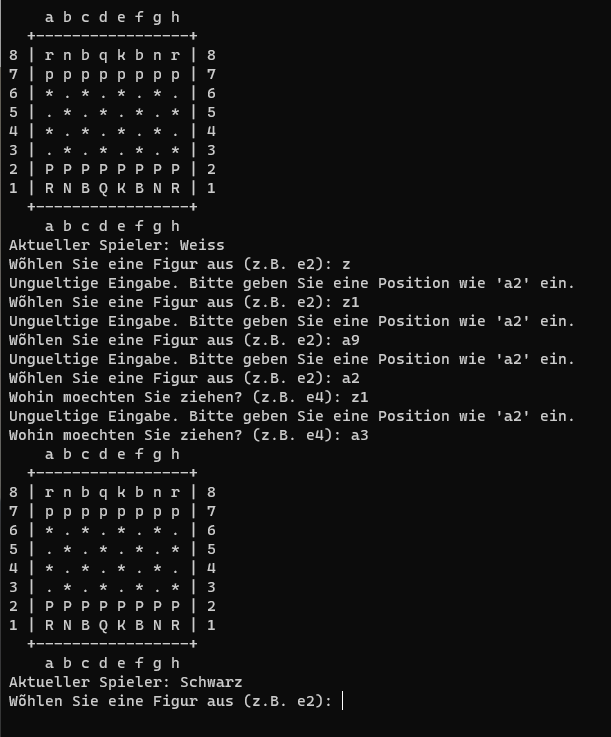

# **SWO3-Übungen - WS2023/24 - Übungszettel 7 - Ausarbeitung**

## **Beispiel 1**

### **Lösungsidee**

#### Wesentliche Datenstrukturen und Algorithmen

Das Schachprogramm basiert auf einem objektorientierten Design, das sich auf zwei Hauptklassen stützt:

##### `Chessman`

- Abstrakte Basisklasse für Schachfiguren.
- Definiert Methoden wie `getSymbol()`, `getColor()`, `isEssential()`, und `canMoveTo()`.
- Die `canMoveTo()` Methode ist ein entscheidender Algorithmus, der die Bewegungsregeln jeder Figur gemäß den Schachregeln prüft.

##### Abgeleitete Klassen von `Chessman` (`Bishop`, `Knight`, etc.)

- Implementieren die spezifischen Bewegungsregeln in der `canMoveTo()` Methode.
- Überprüfen, ob die Zielfelder gemäß den Spielregeln erreichbar sind, einschließlich der Überprüfung auf blockierte Wege.

##### `Chessboard`

- Enthält ein 2D-Array von `unique_ptr` zu `Chessman`, repräsentiert das Spielbrett.
- Verwaltet den Spielzustand und bietet Methoden wie `initializeGame()`, `drawBoard()`, `markSelectedPiece()`, und `showPossibleMoves()`.

#### Grundstruktur der Implementierung

- **`initializeGame()`**: Initialisiert das Spielbrett mit den Figuren in ihren Startpositionen.
- **`drawBoard()`**: Zeigt das Spielbrett und die Positionen der Figuren an.
- **`markSelectedPiece()` und `showPossibleMoves()`**: Heben die ausgewählte Figur und ihre möglichen Züge hervor.
- **`getPieceAt()`**: Greift auf eine Figur an einer gegebenen Position zu.
- **`switchPlayer()`**: Wechselt den Spieler nach jedem Zug.
- **`isGameOver()`**: Prüft, ob das Spiel beendet ist (Schachmatt oder Patt).

### **Testfälle**

Grundsätzlicher UI Aufbau, Abfrage und Eingabe der Spielerzüge, Spielerwechsel

Prüfung der Eingabe auf Korrektheit